# Payment Reconciliation Automation Solution
## Product Requirements Document

---

## 1. Problem Statement / Challenge Description

### Current Situation
Grupo Nazan, a leading Mexican footwear retailer, processes approximately **9,000 orders per month** through their B2B e-commerce platform, with digital operations representing 88% of their business. However, **91% of transactions** rely on promising/offline payment methods (POS payments, bank deposits, and convenience store payments), creating a significant operational bottleneck.

### Operational Impact
The current manual reconciliation process requires **9 full-time call center agents** performing repetitive, error-prone tasks:

- Daily login to 4 separate banking institution portals
- Manual PDF download and transaction filtering
- Manual matching of payment references to order numbers
- Individual OMS lookups and order releases

### Business Pain Points

**Productivity Crisis**
- 9 FTE dedicated exclusively to payment reconciliation
- Average processing time: 5-8 minutes per transaction
- Monthly capacity: ~9,000 manual reconciliations

**Operational Risks**
- High fraud exposure due to manual verification gaps
- Consistent SLA breaches affecting customer satisfaction
- No support for partial payments or overpayment scenarios
- Zero visibility into processing errors or bottlenecks

**Financial Impact**
- Delayed order releases = delayed revenue recognition
- Customer churn risk from fulfillment delays
- Operational cost: ~$45K-60K USD annually (9 FTE allocation)

---

## 2. Solution Overview

### Intelligent Payment Reconciliation Platform
An AI-powered automation solution that transforms manual payment reconciliation into an intelligent, exception-based process. The platform leverages OCR/AI for document processing, API integration for system orchestration, and machine learning for anomaly detection.

### Key Benefits

**Operational Excellence**
- **95% automation rate**: Reduce manual touchpoints from 9,000 to <450 orders/month
- **80% productivity gain**: Redeploy 7-8 FTE to revenue-generating activities
- **Real-time processing**: Orders released within 15 minutes of payment confirmation

**Risk Mitigation**
- AI-powered fraud detection identifying suspicious transaction patterns
- Complete audit trail with automated logging
- Configurable tolerance thresholds preventing minor discrepancy delays

**Customer Experience**
- **90% SLA compliance improvement**: On-time order fulfillment
- Support for partial payments and flexible payment scenarios
- Proactive email notifications for payment status

**Financial Impact**
- **ROI: 450%** within 12 months
- Annual savings: $50K-70K USD in operational costs
- Revenue acceleration through faster order processing

### Target KPIs

| Metric | Current | Target (6 months) | Target (12 months) |
|--------|---------|-------------------|-------------------|
| **Automation Rate** | 0% | 85% | 95% |
| **Manual FTE Required** | 9 | 2-3 | 1-2 |
| **Average Processing Time** | 5-8 min | 30 sec | 15 sec |
| **SLA Compliance** | 65% | 90% | 95% |
| **Fraud Detection Rate** | Manual only | 75% | 90% |
| **Processing Errors** | Not tracked | <2% | <0.5% |
| **Cost per Transaction** | $6.50 | $1.20 | $0.50 |

---

## 3. Solution Process Outline (TO BE)

### Process Overview
The automated payment reconciliation process transforms the current manual, error-prone workflow into an intelligent, exception-based operation. The system operates continuously with minimal human intervention, processing transactions every 15 minutes and escalating only exceptions that require human judgment.

---

### TO BE Process Flow

---

## 4. Solution Architecture Highlights

### Core Components

**Intelligent Document Processor**
- Multi-bank PDF format recognition
- OCR with 95%+ accuracy for reference extraction
- Adaptive learning for format variations

**Reconciliation Engine**
- Real-time OMS API integration
- Matching algorithm: reference → order → payment validation
- Configurable business rules (tolerance, partial payments)

**Exception Management**
- Queue-based manual review workflow
- Priority scoring (fraud risk, amount, customer tier)
- Evidence attachment and approval workflow

**Monitoring & Analytics**
- Real-time processing dashboard
- Error classification and alerting
- Automated vs. manual metrics tracking

---

## 5. Solution Naming Candidates

1. **PayFlow AI** - Emphasizes intelligent payment automation flow
2. **ReconPro MX** - Professional reconciliation for Mexican market
3. **SwiftMatch** - Fast, accurate payment matching
4. **PaySync Automation** - Synchronized payment reconciliation
5. **ClearPay Engine** - Clear, transparent payment processing
6. **VelocityPay** - Speed-focused payment reconciliation
7. **AutoRecon Suite** - Comprehensive automated reconciliation
8. **PayPulse Platform** - Real-time payment processing heartbeat
9. **ReconAI Hub** - Central AI-powered reconciliation platform
10. **TruePay Match** - Accurate, trustworthy payment matching

---

## 6. Success Criteria

### Go-Live Readiness
- ✅ 95% automated matching accuracy
- ✅ <2% error rate in production testing
- ✅ 2 trained operators capable of exception handling
- ✅ Complete audit trail for 30-day validation period

### 6-Month Success
- ✅ 85% automation rate sustained
- ✅ 90% SLA compliance achieved
- ✅ 7 FTE redeployed to strategic initiatives
- ✅ Zero critical fraud incidents

### 12-Month Excellence
- ✅ 95% automation rate
- ✅ <0.5% processing error rate
- ✅ ROI validated at 450%+
- ✅ Scalability demonstrated (support 50% order growth)

---

# Solution Architecture Components

### High-Level Component Diagram

---

## Component Descriptions

### 1. **Job Scheduler** (Cron Service)
**Purpose**: Orchestrates automated execution of reconciliation cycles

**Functionality**:
- Triggers bank connector every 15 minutes
- Manages retry logic for failed jobs
- Coordinates parallel processing across 4 banks
- Maintains job execution history

**Technology Stack**: Airflow / Kubernetes CronJobs / AWS EventBridge

---

### 2. **Multi-Bank Connector** (RPA/Selenium)
**Purpose**: Automates interaction with banking portals

**Functionality**:
- Headless browser automation for 4 bank portals
- Secure authentication using credential vault
- Transaction filtering by date range
- PDF download and storage
- Connection health monitoring

**Technology Stack**: Selenium WebDriver / Puppeteer / UiPath

**User Stories**:
- As an operations agent, I want the system to automatically log into bank portals so I don't have to do it manually 36 times per day
- As a system admin, I want to configure bank credentials securely so authentication is centralized

---

### 3. **Credential Vault** (Secure Storage)
**Purpose**: Secure management of banking credentials

**Functionality**:
- Encrypted storage of bank login credentials
- Token rotation and expiration management
- Access control and audit logging
- Secret versioning for credential updates

**Technology Stack**: HashiCorp Vault / AWS Secrets Manager / Azure Key Vault

---

### 4. **AI/OCR Engine** (Document Processor)
**Purpose**: Extracts structured data from bank transaction PDFs

**Functionality**:
- PDF layout analysis and zone detection
- Text extraction with 95%+ accuracy
- Multi-format support (4 bank templates)
- Confidence scoring for extractions
- Self-learning from operator corrections

**Technology Stack**: Tesseract OCR / AWS Textract / Google Document AI / Custom ML Model

**User Stories**:
- As an operations agent, I want the system to read PDF transactions automatically so I don't have to manually transcribe reference numbers
- As a data scientist, I want to train the OCR model on new bank formats so accuracy improves over time

---

### 5. **Reconciliation Engine** (Matching Logic)
**Purpose**: Core business logic for payment-to-order matching

**Functionality**:
- Reference number lookup via OMS API
- Payment amount validation with tolerance
- Partial payment tracking and aggregation
- Duplicate payment detection
- Order release automation

**Technology Stack**: Python / Java / Node.js (Backend Service)

**User Stories**:
- As an operations agent, I want the system to automatically match payments to orders so I don't have to search the OMS manually
- As a business analyst, I want to configure tolerance thresholds so minor payment discrepancies don't block orders

---

### 6. **Fraud Detection** (ML Model)
**Purpose**: AI-powered risk assessment for transactions

**Functionality**:
- Velocity-based anomaly detection
- Pattern recognition (timing, amounts, geography)
- Customer behavior profiling
- Risk scoring (0-100 scale)
- Model retraining pipeline

**Technology Stack**: Python (scikit-learn/TensorFlow) / AWS SageMaker / Azure ML

**User Stories**:
- As a fraud analyst, I want the system to flag suspicious transactions automatically so I can prevent fraud losses
- As an operations manager, I want to see fraud risk scores so my team can prioritize high-risk reviews

---

### 7. **Business Rules Engine** (Validation & Tolerance)
**Purpose**: Configurable decision-making framework

**Functionality**:
- Tolerance threshold management (99-101% default)
- Overpayment/underpayment routing logic
- Partial payment policies
- Auto-release criteria configuration
- Rule versioning and audit trail

**Technology Stack**: Drools / Easy Rules / Custom Rules Engine

**User Stories**:
- As a product owner, I want to configure payment tolerance rules so business policies can change without code changes
- As an operations manager, I want to set overpayment thresholds so large discrepancies are flagged for review

---

### 8. **Reconciliation Database** (PostgreSQL)
**Purpose**: Primary data store for transactions and orders

**Functionality**:
- Transaction history and status tracking
- Payment-to-order relationship mapping
- Partial payment accumulation
- Audit trail storage
- Performance metrics data

**Technology Stack**: PostgreSQL / MySQL / SQL Server

---

### 9. **Redis Cache** (Session & Queue Management)
**Purpose**: High-performance caching and temporary data storage

**Functionality**:
- Session management for user authentication
- Exception queue management
- API response caching
- Real-time counter tracking (daily processed orders)

**Technology Stack**: Redis / Memcached

---

### 10. **Document Storage** (S3/Blob)
**Purpose**: Secure storage for bank PDFs and evidence files

**Functionality**:
- PDF archive (30-day retention)
- Evidence file storage (manual releases)
- Versioning and lifecycle management
- Access logging and encryption

**Technology Stack**: AWS S3 / Azure Blob Storage / Google Cloud Storage

---

### 11. **REST API** (Backend Services)
**Purpose**: Application programming interface for all interactions

**Functionality**:
- Dashboard data endpoints
- Manual release operations
- Configuration management
- Report generation
- OMS integration proxy

**Technology Stack**: Node.js (Express) / Python (FastAPI) / Java (Spring Boot)

**User Stories**:
- As a frontend developer, I want a REST API so the dashboard can retrieve reconciliation data
- As an integrations developer, I want API endpoints to trigger manual reconciliation so external systems can initiate processing

---

### 12. **Operations Dashboard** (Web UI)
**Purpose**: Primary interface for call center agents

**Functionality**:
- Real-time queue visibility (exceptions, pending reviews)
- Transaction search and filtering
- Manual release workflow with evidence upload
- Performance metrics and KPI display
- Mobile-responsive design

**Technology Stack**: React / Vue.js / Angular + Tailwind CSS

**User Stories**:
- As an operations agent, I want a dashboard showing pending exceptions so I can prioritize my work
- As an operations agent, I want to manually release orders with evidence upload so I can handle edge cases
- As an operations manager, I want to see team performance metrics so I can track productivity

---

### 13. **Admin Console** (Configuration UI)
**Purpose**: System configuration and management interface

**Functionality**:
- User role and permission management
- Tolerance threshold configuration
- Bank connector settings
- Fraud detection parameter tuning
- System health monitoring

**Technology Stack**: React Admin / Retool / Custom Admin Panel

**User Stories**:
- As a system admin, I want to manage user roles so access is properly controlled
- As a product owner, I want to adjust tolerance thresholds so business rules can be updated quickly

---

### 14. **Message Queue** (RabbitMQ/SQS)
**Purpose**: Asynchronous task and event management

**Functionality**:
- Exception routing to manual review queues
- Email notification queuing
- Retry mechanism for failed operations
- Event-driven architecture support

**Technology Stack**: RabbitMQ / AWS SQS / Azure Service Bus / Apache Kafka

---

### 15. **Notification Service** (Email/SMS)
**Purpose**: Multi-channel alerting and communication

**Functionality**:
- Customer order release notifications
- Operator alert emails (errors, high-priority exceptions)
- Daily summary reports
- SMS alerts for critical failures

**Technology Stack**: SendGrid / AWS SES / Twilio (SMS)

**User Stories**:
- As an operations manager, I want email alerts for bank connection failures so I can respond quickly
- As a customer, I want to receive confirmation when my order is released so I know it's being processed

---

### 16. **Audit Logger** (Event Stream)
**Purpose**: Comprehensive activity and compliance logging

**Functionality**:
- User action tracking (who, what, when, why)
- System event logging (releases, errors, configuration changes)
- Compliance reporting
- Forensic analysis support

**Technology Stack**: ELK Stack (Elasticsearch/Logstash/Kibana) / Splunk / AWS CloudWatch

**User Stories**:
- As a compliance officer, I want complete audit logs so I can demonstrate regulatory compliance
- As a system admin, I want to track all manual releases so I can investigate discrepancies

---

## User Story Map - Version 1.0

### User Story Map Structure

```mermaid
graph TB
    subgraph "Epic 1: Automated Bank Integration"
        E1_USER["👤 Operations Agent"]
        E1_ACTIVITY["🎯 Retrieve Bank Transactions"]
        
        E1_S1["📋 Login to Bank Portals<br/>Priority: MUST<br/>Story Points: 5"]
        E1_S2["📋 Download Transaction PDFs<br/>Priority: MUST<br/>Story Points: 3"]
        E1_S3["📋 Handle Connection Errors<br/>Priority: MUST<br/>Story Points: 5"]
        E1_S4["📋 Schedule Automatic Retrieval<br/>Priority: MUST<br/>Story Points: 3"]
        
        E1_USER --> E1_ACTIVITY
        E1_ACTIVITY --> E1_S1
        E1_ACTIVITY --> E1_S2
        E1_ACTIVITY --> E1_S3
        E1_ACTIVITY --> E1_S4
    end

    subgraph "Epic 2: Intelligent Document Processing"
        E2_USER["👤 Operations Agent"]
        E2_ACTIVITY["🎯 Extract Payment Data"]
        
        E2_S1["📋 OCR PDF Transactions<br/>Priority: MUST<br/>Story Points: 8"]
        E2_S2["📋 Validate Extraction Accuracy<br/>Priority: MUST<br/>Story Points: 5"]
        E2_S3["📋 Handle OCR Failures<br/>Priority: MUST<br/>Story Points: 5"]
        E2_S4["📋 Support Multiple Bank Formats<br/>Priority: SHOULD<br/>Story Points: 8"]
        
        E2_USER --> E2_ACTIVITY
        E2_ACTIVITY --> E2_S1
        E2_ACTIVITY --> E2_S2
        E2_ACTIVITY --> E2_S3
        E2_ACTIVITY --> E2_S4
    end

    subgraph "Epic 3: Automated Reconciliation"
        E3_USER["👤 Operations Agent"]
        E3_ACTIVITY["🎯 Match Payments to Orders"]
        
        E3_S1["📋 Query OMS by Reference<br/>Priority: MUST<br/>Story Points: 5"]
        E3_S2["📋 Validate Payment Amounts<br/>Priority: MUST<br/>Story Points: 3"]
        E3_S3["📋 Apply Tolerance Rules<br/>Priority: MUST<br/>Story Points: 5"]
        E3_S4["📋 Handle Unmatched Transactions<br/>Priority: MUST<br/>Story Points: 5"]
        E3_S5["📋 Track Partial Payments<br/>Priority: SHOULD<br/>Story Points: 8"]
        
        E3_USER --> E3_ACTIVITY
        E3_ACTIVITY --> E3_S1
        E3_ACTIVITY --> E3_S2
        E3_ACTIVITY --> E3_S3
        E3_ACTIVITY --> E3_S4
        E3_ACTIVITY --> E3_S5
    end

    subgraph "Epic 4: Fraud Detection"
        E4_USER["👤 Fraud Analyst"]
        E4_ACTIVITY["🎯 Identify Suspicious Transactions"]
        
        E4_S1["📋 Calculate Fraud Risk Score<br/>Priority: SHOULD<br/>Story Points: 13"]
        E4_S2["📋 Flag High-Risk Transactions<br/>Priority: SHOULD<br/>Story Points: 5"]
        E4_S3["📋 Review Fraud Indicators<br/>Priority: SHOULD<br/>Story Points: 8"]
        E4_S4["📋 Train ML Model<br/>Priority: COULD<br/>Story Points: 13"]
        
        E4_USER --> E4_ACTIVITY
        E4_ACTIVITY --> E4_S1
        E4_ACTIVITY --> E4_S2
        E4_ACTIVITY --> E4_S3
        E4_ACTIVITY --> E4_S4
    end

    subgraph "Epic 5: Order Release Automation"
        E5_USER["👤 Operations Agent"]
        E5_ACTIVITY["🎯 Release Validated Orders"]
        
        E5_S1["📋 Auto-Release Low-Risk Orders<br/>Priority: MUST<br/>Story Points: 5"]
        E5_S2["📋 Update Order Status in OMS<br/>Priority: MUST<br/>Story Points: 3"]
        E5_S3["📋 Send Customer Notifications<br/>Priority: SHOULD<br/>Story Points: 5"]
        E5_S4["📋 Log Release Transactions<br/>Priority: MUST<br/>Story Points: 3"]
        
        E5_USER --> E5_ACTIVITY
        E5_ACTIVITY --> E5_S1
        E5_ACTIVITY --> E5_S2
        E5_ACTIVITY --> E5_S3
        E5_ACTIVITY --> E5_S4
    end

    subgraph "Epic 6: Exception Management"
        E6_USER["👤 Operations Agent"]
        E6_ACTIVITY["🎯 Handle Manual Reviews"]
        
        E6_S1["📋 View Exception Queue<br/>Priority: MUST<br/>Story Points: 5"]
        E6_S2["📋 Review Transaction Details<br/>Priority: MUST<br/>Story Points: 3"]
        E6_S3["📋 Manually Release Orders<br/>Priority: MUST<br/>Story Points: 5"]
        E6_S4["📋 Upload Evidence Files<br/>Priority: MUST<br/>Story Points: 5"]
        E6_S5["📋 Reject Fraudulent Transactions<br/>Priority: SHOULD<br/>Story Points: 5"]
        
        E6_USER --> E6_ACTIVITY
        E6_ACTIVITY --> E6_S1
        E6_ACTIVITY --> E6_S2
        E6_ACTIVITY --> E6_S3
        E6_ACTIVITY --> E6_S4
        E6_ACTIVITY --> E6_S5
    end

    subgraph "Epic 7: Monitoring & Reporting"
        E7_USER["👤 Operations Manager"]
        E7_ACTIVITY["🎯 Monitor Performance"]
        
        E7_S1["📋 View Real-Time Dashboard<br/>Priority: MUST<br/>Story Points: 8"]
        E7_S2["📋 Track KPI Metrics<br/>Priority: MUST<br/>Story Points: 5"]
        E7_S3["📋 Receive Error Alerts<br/>Priority: MUST<br/>Story Points: 5"]
        E7_S4["📋 Generate Reports<br/>Priority: SHOULD<br/>Story Points: 8"]
        E7_S5["📋 Export Data<br/>Priority: COULD<br/>Story Points: 5"]
        
        E7_USER --> E7_ACTIVITY
        E7_ACTIVITY --> E7_S1
        E7_ACTIVITY --> E7_S2
        E7_ACTIVITY --> E7_S3
        E7_ACTIVITY --> E7_S4
        E7_ACTIVITY --> E7_S5
    end

    subgraph "Epic 8: System Administration"
        E8_USER["👤 System Admin"]
        E8_ACTIVITY["🎯 Configure & Manage"]
        
        E8_S1["📋 Manage User Roles<br/>Priority: MUST<br/>Story Points: 8"]
        E8_S2["📋 Configure Tolerance Rules<br/>Priority: MUST<br/>Story Points: 5"]
        E8_S3["📋 Update Bank Credentials<br/>Priority: MUST<br/>Story Points: 3"]
        E8_S4["📋 Monitor System Health<br/>Priority: SHOULD<br/>Story Points: 5"]
        
        E8_USER --> E8_ACTIVITY
        E8_ACTIVITY --> E8_S1
        E8_ACTIVITY --> E8_S2
        E8_ACTIVITY --> E8_S3
        E8_ACTIVITY --> E8_S4
    end

    style E1_S1 fill:#90EE90
    style E1_S2 fill:#90EE90
    style E1_S3 fill:#90EE90
    style E1_S4 fill:#90EE90
    style E2_S1 fill:#90EE90
    style E2_S2 fill:#90EE90
    style E2_S3 fill:#90EE90
    style E3_S1 fill:#90EE90
    style E3_S2 fill:#90EE90
    style E3_S3 fill:#90EE90
    style E3_S4 fill:#90EE90
    style E5_S1 fill:#90EE90
    style E5_S2 fill:#90EE90
    style E5_S4 fill:#90EE90
    style E6_S1 fill:#90EE90
    style E6_S2 fill:#90EE90
    style E6_S3 fill:#90EE90
    style E6_S4 fill:#90EE90
    style E7_S1 fill:#90EE90
    style E7_S2 fill:#90EE90
    style E7_S3 fill:#90EE90
    style E8_S1 fill:#90EE90
    style E8_S2 fill:#90EE90
    style E8_S3 fill:#90EE90
```

---

## User Story Map - Detailed Breakdown

### Release Planning

**MVP (Must Have - Release 1.0)**
- Epic 1: Automated Bank Integration (All stories)
- Epic 2: Intelligent Document Processing (Stories 1-3)
- Epic 3: Automated Reconciliation (Stories 1-4)
- Epic 5: Order Release Automation (Stories 1, 2, 4)
- Epic 6: Exception Management (All MUST stories)
- Epic 7: Monitoring & Reporting (Stories 1-3)
- Epic 8: System Administration (Stories 1-3)

**Total Story Points (MVP)**: ~105 points

---

**Release 1.5 (Should Have)**
- Epic 2: Story 4 (Multiple bank format support)
- Epic 3: Story 5 (Partial payment tracking)
- Epic 4: Fraud Detection (Stories 1-3)
- Epic 5: Story 3 (Customer notifications)
- Epic 6: Story 5 (Reject fraudulent transactions)
- Epic 7: Story 4 (Report generation)
- Epic 8: Story 4 (System health monitoring)

**Total Story Points (Release 1.5)**: ~60 points

---

**Release 2.0 (Could Have)**
- Epic 4: Story 4 (ML model training)
- Epic 7: Story 5 (Data export)

**Total Story Points (Release 2.0)**: ~18 points

---

### Epic Prioritization Matrix

| Epic | Business Value | Technical Complexity | Priority | Release |
|------|----------------|---------------------|----------|---------|
| **Epic 1: Bank Integration** | Critical | Medium | P0 | MVP |
| **Epic 2: Document Processing** | Critical | High | P0 | MVP |
| **Epic 3: Reconciliation** | Critical | Medium | P0 | MVP |
| **Epic 5: Order Release** | Critical | Low | P0 | MVP |
| **Epic 6: Exception Management** | High | Medium | P0 | MVP |
| **Epic 7: Monitoring** | High | Medium | P0 | MVP |
| **Epic 8: Administration** | High | Low | P0 | MVP |
| **Epic 4: Fraud Detection** | Medium | Very High | P1 | v1.5 |

---

## Key User Personas

### 1. **Operations Agent** (Primary User)
- **Goal**: Process payment reconciliations efficiently
- **Pain Points**: Manual data entry, system switching, unclear priorities
- **Needs**: Simple dashboard, clear exception queues, fast order release

### 2. **Operations Manager** (Secondary User)
- **Goal**: Monitor team performance and ensure SLA compliance
- **Pain Points**: No visibility into processing metrics, manual reporting
- **Needs**: Real-time KPI dashboard, performance analytics, alert management

### 3. **System Administrator** (Technical User)
- **Goal**: Maintain system health and configuration
- **Pain Points**: Complex credential management, no system monitoring
- **Needs**: Admin console, health dashboard, configuration management

### 4. **Fraud Analyst** (Specialized User)
- **Goal**: Identify and prevent fraudulent transactions
- **Pain Points**: Manual fraud review, no pattern detection
- **Needs**: Risk scoring, fraud indicators, investigation tools

### 5. **Executive/C-Level** (Stakeholder)
- **Goal**: Understand ROI and business impact
- **Pain Points**: Lack of business metrics, unclear cost savings
- **Needs**: Executive dashboard, ROI reports, strategic insights

---

**Document Version**: 1.0  
**Last Updated**: October 29, 2025  
**Owner**: Product Management - Digital Payments
